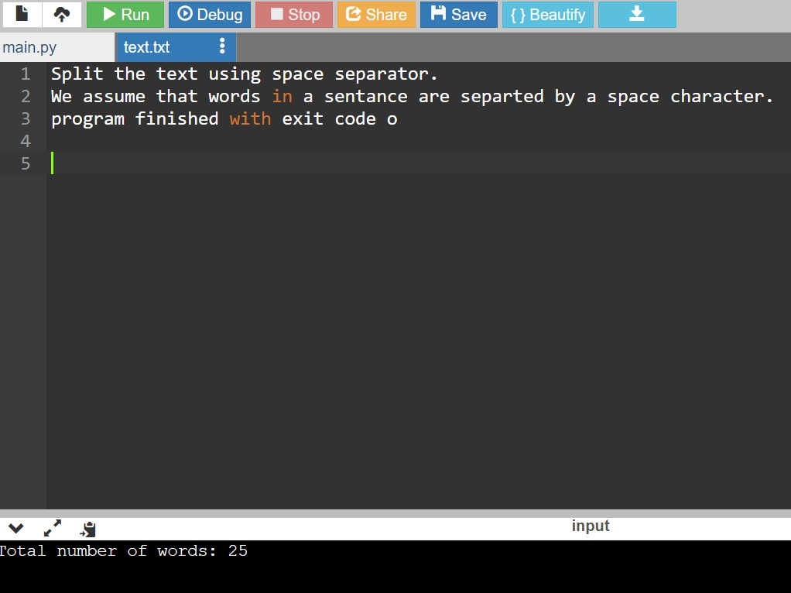

# Word-count
## AIM:
To write a python program for getting the word count from a text.
## EQUIPEMENT'S REQUIRED: 
PC
Anaconda - Python 3.7
## ALGORITHM: 
### Step 1:
create the file name text.txt 

### Step 2: 
write the program 
 
### Step 3: 
Split the text using space separator.We assume that words in a sentance are separted by a space character.
### Step 4:  
The length of the split list should equal the numbers of words in the test file.
### Step 5: 
You can refine the count by cleaning the string prior to splitting or validating the words after splitting.

### Step 6: 
end the program

## PROGRAM:
```
def program():
    count=0
    with open("text.txt","r") as f:
        for data in f:
            words=data.split()
            for word in words:
                count+=1
    print("Total number of words:",count)
program()
```


### OUTPUT:



## RESULT:
the program excicute successfully
